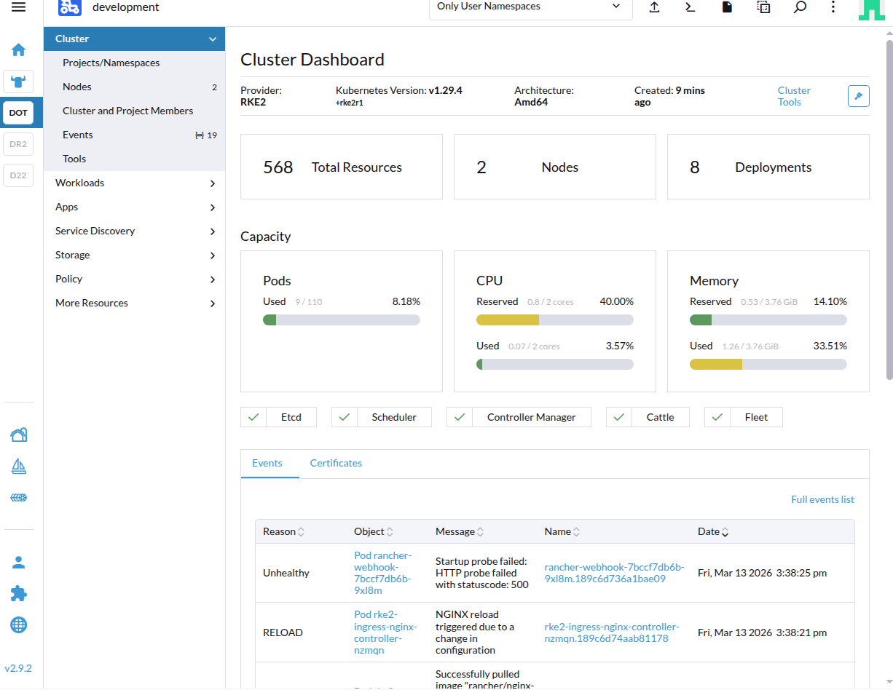

# terraform-aws-platform

## Overview

This repository captures a validated platform engineering workflow for building a Rancher-managed Kubernetes platform on AWS with Terraform.

The validated implementation covers:

- bootstrap `k3s` on AWS
- Rancher on the bootstrap cluster
- cert-manager with a Let's Encrypt `ClusterIssuer`
- downstream RKE2 provisioned by Rancher on AWS
- `aws-cloud-controller-manager` in the downstream cluster
- Traefik customized through `HelmChartConfig`
- Traefik exposed as `Service` type `LoadBalancer`
- AWS Network Load Balancer reconciliation
- delegated public DNS in Route53 for downstream applications
- Argo CD exposed through Traefik ingress

## Validated Architecture

```text
+-----------------------------------------------------------------------------------+
|                                        AWS                                        |
|-----------------------------------------------------------------------------------|
| VPC / subnet / security groups                                                    |
| EC2 bootstrap node for k3s                                                        |
| EC2 downstream nodes for RKE2                                                     |
+-----------------------------------------+-----------------------------------------+
                                          |
                                          v
+-----------------------------------------------------------------------------------+
|                              Bootstrap k3s cluster                                |
|-----------------------------------------------------------------------------------|
| cert-manager                                                                      |
| ClusterIssuer (Let's Encrypt)                                                     |
| Rancher                                                                           |
+-----------------------------------------+-----------------------------------------+
                                          |
                                          v
+-----------------------------------------------------------------------------------+
|                        Rancher-managed downstream RKE2 cluster                     |
|-----------------------------------------------------------------------------------|
| Control plane and worker machine pools on AWS                                     |
| aws-cloud-controller-manager                                                      |
| Traefik packaged with RKE2, customized via HelmChartConfig                        |
| Service type LoadBalancer for rke2-traefik                                        |
+-----------------------------------------+-----------------------------------------+
                                          |
                                          v
+-----------------------------------------------------------------------------------+
|                              AWS Network Load Balancer                            |
|-----------------------------------------------------------------------------------|
| NLB created from the Traefik Service type LoadBalancer                            |
| Traffic forwarded to Traefik                                                      |
+-----------------------------------------+-----------------------------------------+
                                          |
                                          v
+-----------------------------------------------------------------------------------+
|                                  Ingress traffic                                  |
|-----------------------------------------------------------------------------------|
| Route53 delegated subdomain for downstream app hostnames                          |
| Argo CD exposed through Traefik ingress                                           |
| Validated through the AWS NLB with the expected Host header before DNS wiring     |
+-----------------------------------------------------------------------------------+
```

## Key Validated Outcomes

With the current validated code path, this repository demonstrates:

- a bootstrap k3s cluster on AWS for Rancher
- Rancher served with cert-manager-managed TLS
- a Rancher-managed downstream RKE2 cluster on AWS
- external AWS cloud-provider integration through `aws-cloud-controller-manager`
- Traefik exposed by a Kubernetes `LoadBalancer` Service and reconciled to an AWS NLB
- a persistent Route53 delegated public DNS layer for downstream application hostnames
- downstream application exposure through Traefik ingress
- Argo CD deployed in the downstream cluster and validated through the AWS NLB with the expected Host header before DNS wiring
- Rancher project and namespace resources created after cluster readiness

## Screenshot



## Why This Project Matters

This project shows a practical multi-stage platform build rather than an isolated Terraform demo. It validates the handoff from infrastructure provisioning to bootstrap cluster services, Rancher-based downstream provisioning, AWS cloud integration, and application exposure through Traefik and an AWS NLB.

## Repository Structure

```text
terraform/
├── README.md
├── aws-root/
├── modules/
├── platform/
└── rancher/
```

Use [terraform/README.md](terraform/README.md) as the operational guide for Terraform root order, apply and destroy steps, prerequisites, IAM setup, ingress behavior, and troubleshooting.

For public DNS, the delegated subdomain is `infra.garciapass.fr`. The Route53 root at `terraform/platform/platform-public-dns-root` follows the same AWS provider pattern as the other downstream roots: use explicit `aws_region` when provided, otherwise fall back to `aws-root` remote state. OVH only needs a one-time NS delegation to the Route53 hosted zone created by that root. After that, downstream application DNS changes happen only in Route53, and the hosted zone is intentionally kept persistent across downstream cluster redeploys.
